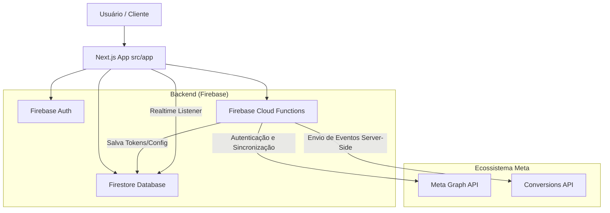

# Documentação Completa: Integração Meta & Conversões Offline (CAPI)

Esta documentação consolida as especificações técnicas, fluxos de arquitetura e padrões de segurança implementados no sistema para a integração com o Meta (Facebook/Instagram) e o envio de conversões offline via Conversions API (CAPI).

---

## 1. Visão Geral da Arquitetura

O sistema emprega uma arquitetura baseada em **Next.js (Frontend)** e **Firebase (Backend)** para gerenciar a integração com o Meta de forma segura e reativa.



### 1.1 Persistência e Reatividade
As configurações do usuário (tokens, conta de anúncios padrão, pixels) são salvas no Firestore no documento `users/{user_email}`. O Frontend utiliza um **Realtime Listener** (via `useAuth` e `AuthProvider`) para refletir automaticamente qualquer mudança nessas configurações em todas as telas da aplicação, sem necessidade de *refresh*.

---

## 2. Fluxo de Autenticação (OAuth 2.0)

Para manter a segurança (segredos no servidor), a autenticação segue um fluxo híbrido:

1. **Início (Frontend)**: O usuário clica em "Conectar com Facebook" e o SDK do Meta solicita permissões (`ads_management`, `ads_read`, `business_management`).
2. **Callback**: O Meta redireciona para a rota de callback passando um `code`.
3. **Cloud Function (`authMetaUser`)**: 
   - Recebe o `code` e o troca por um `short_lived_token`.
   - Troca o `short_lived_token` por um `long_lived_token` (válido por 60 dias).
   - Salva o token de forma segura no Firestore.

---

## 3. Conversões Offline e CAPI (Server-Side)

A integração principal de marketing é o envio de eventos (como compras e leads) do servidor diretamente para o Meta, superando bloqueadores de anúncios e restrições de navegadores.

### 3.1. Segurança e Proteção de Dados (Hashing)
> **IMPORTANTE:** Em conformidade com a LGPD e as políticas do Meta, nenhuma informação de identificação pessoal (PII) é enviada em texto plano.

Todos os dados de usuários são normalizados (espaços removidos, convertido para letras minúsculas) e criptografados usando **SHA-256** antes de sair do nosso servidor.

**Tratamento por Campo:**
- **Email (`em`)**: Lowercase + Trim + SHA-256
- **Telefone (`ph`)**: Lowercase + Trim + SHA-256
- **Nome (`fn`) / Sobrenome (`ln`)**: Lowercase + Trim + SHA-256
- **Cidade/Estado/CEP/País**: Lowercase + Trim + SHA-256
- **External ID (`external_id`)**: SHA-256

*Nota: Cookies proprietários como `fbp` e `fbc` **não** são hasheados.*

### 3.2. Estrutura do Payload (CapiEvent)
Os eventos enviados à API de Conversões respeitam o formato da Graph API v19.0.

```json
{
  "data": [
    {
      "event_name": "Purchase",
      "event_time": 1716300000,
      "action_source": "system_generated",
      "user_data": {
        "em": "e3b0c44298fc1c149afbf4c8996fb924...", 
        "ph": "5e884898da28047151d0e56f8dc62927...",
        "external_id": "sha256(id_da_transacao)",
        "client_ip_address": "...",
        "client_user_agent": "..."
      },
      "custom_data": {
        "currency": "BRL",
        "value": 150.0
      }
    }
  ],
  "access_token": "EAA..."
}
```

### 3.3. Deduplicação
Para evitar que o Meta conte o mesmo evento duas vezes (uma via navegador e outra via CAPI), utilizamos:
1. `event_name`: O nome do evento deve coincidir.
2. `event_id` ou `external_id`: O sistema utiliza o ID da transação (`transactionId`) como `external_id`. 

> **DICA:** O Pixel do site (frontend) deve enviar os mesmos IDs gerados para que a deduplicação do Meta alcance a eficiência máxima.

---

## 4. Métodos de Disparo de Eventos

A aplicação expõe diferentes formas de enviar conversões para o Meta via Cloud Functions (localizadas em `src/services/meta/conversionsApi.ts`).

### 4.1. Sincronização em Lote (`syncOfflineData`)
Processa vendas históricas (backfill) provenientes do banco de dados (coleção `purchases`).
- **Mecanismo**: Puxa os dados com base em `startDate` e `endDate`.
- **Filtro**: Rejeita eventos sem PII (precisa de pelo menos email ou telefone).
- **Dry Run**: Possui um modo de simulação (`dryRun = true`) que não envia dados, apenas loga o que seria enviado.
- **Limites**: Possui um limite padrão de lotes (atualmente limit(50) no MVP) para evitar timeout nas Functions.

### 4.2. Disparo Manual (`sendManualEvent`)
Usado para validação técnica, testes de infraestrutura e reenvios pontuais.
- **Funcionalidade**: Recebe o payload do frontend, realiza o hash e dispara imediatamente um evento único.
- **Ambiente de Teste**: Suporta o envio da tag `test_event_code` para validar a chegada do evento em tempo real na aba "Test Events" do Gerenciador de Negócios do Meta.

### 4.3. Sincronização via Planilhas (`readPurchasesFromSheet`)
Gestores de tráfego podem validar retornos offline (ex: boletos pagos) subindo uma planilha via integração Google Sheets, que o sistema lê e encaminha usando a infraestrutura do CAPI.

---

## 5. Resolução de Problemas (Troubleshooting)

Códigos de erros mais comuns ao operar a integração e como solucioná-los.

| Código Meta      | Significado | Resolução no Sistema |
| :--- | :--- | :--- |
| **`100`** (Invalid Parameter) | Um dos campos do `user_data` foi formatado incorretamente. | Verifique se a pré-formatação do telefone e email (trim/lowercase) ocorreu antes do hash. |
| **`190`** (Invalid OAuth Token) | O token de longa duração expirou ou foi invalidado (ex: troca de senha). | O usuário deve refazer o fluxo em `/meta-integrations`. |
| **`OAuthException`** | O app não tem permissão para a ação solicitada. | Confirmar se o Pixel escolhido realmente pertence ao `adAccountId` selecionado e se o usuário aceitou a permissão `ads_management`. |
